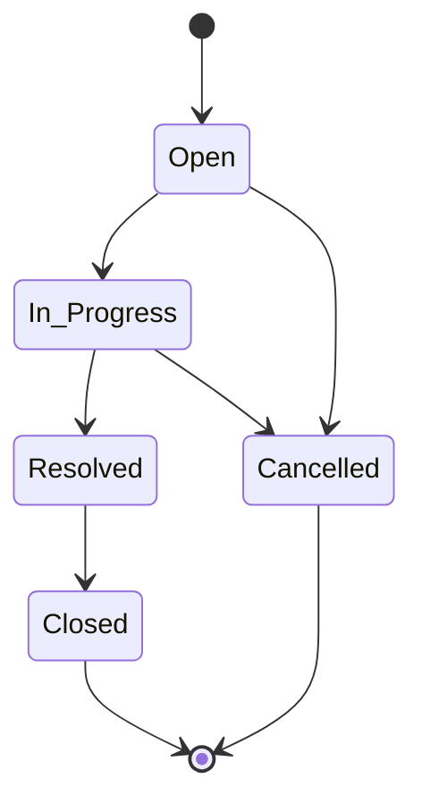

# Ticket Management System — Requirements Specification

## Business Context

A small internal application for managing support tickets. Internal users create, update, comment on, search, and progress tickets through a defined lifecycle.

**Tech Stack**: React.js (Frontend) | Node.js (Backend) | PostgreSQL (Database) | Docker (Containerization)

---

## Data Model

### Entity: User (seeded — no user-management UI required in Core)

| Field | Type | Constraints |
|-------|------|-------------|
| id | UUID / Serial | Primary Key |
| name | String | Required |
| email | String | Required, Unique |
| role | Enum | `admin`, `agent`, `user` |

### Entity: Ticket

| Field | Type | Constraints |
|-------|------|-------------|
| id | UUID / Serial | Primary Key |
| title | String | Required, max 255 chars |
| description | Text | Required |
| priority | Enum | `low`, `medium`, `high`, `critical` |
| status | Enum | `open`, `in_progress`, `resolved`, `closed`, `cancelled` |
| assignedTo | FK → User.id | Nullable |
| prLink | String (URL) | Nullable, valid URL format |
| createdBy | FK → User.id | Required |
| createdAt | Timestamp | Auto-generated |
| updatedAt | Timestamp | Auto-updated |

### Entity: Comment

| Field | Type | Constraints |
|-------|------|-------------|
| id | UUID / Serial | Primary Key |
| ticketId | FK → Ticket.id | Required |
| message | Text | Required |
| createdBy | FK → User.id | Required |
| createdAt | Timestamp | Auto-generated |

---

## Status State Machine (Core — Critical)

This is the **signature judgment piece** — the hardest part of Core.

### Valid Transitions

```
Open         → In Progress
In Progress  → Resolved
Resolved     → Closed
Open         → Cancelled
In Progress  → Cancelled
```

### Rules
- **Only** the transitions listed above are valid
- Invalid transitions MUST be rejected by the backend (return 400/422)
- Frontend MUST handle rejection gracefully and show clear error messages
- Frontend SHOULD only show valid transition buttons for the current status

### State Diagram



---

## Core Features (Mandatory)

### 1. Create a Ticket
- User fills form with: title, description, priority, assignee (optional)
- Status defaults to `Open`
- `createdBy` set from current user context
- Backend validates all required fields

### 2. List Tickets
- Display all tickets in a table/list view
- Show: title, status, priority, assignee, created date
- Support keyword search (searches title and description)
- Support filter by status

### 3. View Ticket Details
- Display all ticket fields
- Display associated comments
- Show available status transitions based on current status

### 4. Update Ticket Fields
- Editable fields: title, description, priority, assignedTo
- Backend validates input
- `updatedAt` auto-updates on save

### 5. Change Ticket Status
- Enforce state machine rules (backend AND frontend)
- Invalid transitions return error with clear message
- Successful transitions update `updatedAt`
- **Kanban Board (Drag & Drop)**: Jira-like board view with columns per status
  - Tickets displayed as cards in their status column
  - Drag a ticket card from one column to another to trigger a status transition
  - State machine rules enforced on drop — invalid drops are rejected with visual error
  - Card snaps back to original column on invalid transition
  - Only valid target columns are highlighted during drag

### 6. Add Comments to a Ticket
- User can add text comments to any ticket
- Comments are immutable (no edit/delete required in Core)
- `createdBy` set from current user context

### 7. Keyword Search & Filter
- Search by keyword across title and description
- Filter by status (dropdown or chips)
- Combinable: search + status filter together

### 8. Data Persistence
- All data stored in PostgreSQL
- Data survives server restart
- Provide migration/schema scripts
- Provide seed data (sample users, tickets, comments)

### 9. Input Validation
- Backend validates all required fields
- Reject invalid/missing data with appropriate HTTP status (400/422)
- Return structured error messages (field-level when possible)

### 10. Error Handling in UI
- Display meaningful error messages for failed operations
- Handle network errors gracefully
- Show loading states during async operations
- Display validation errors inline on forms

---

## Core Acceptance Criteria

| # | Criteria | Verified By |
|---|----------|-------------|
| 1 | A user can create a ticket via the UI | Manual + Integration Test |
| 2 | A user can view all tickets from the database | Manual + Integration Test |
| 3 | A user can open a ticket detail view | Manual |
| 4 | A user can update ticket fields and reassign | Manual + Integration Test |
| 5 | A user can add comments | Manual + Integration Test |
| 6 | Status changes only through valid transitions; invalid ones are rejected | **Integration Test (Mandatory)** |
| 7 | Keyword search and status filter work | Manual + Integration Test |
| 8 | Data remains available after restart | Manual verification |
| 9 | Backend validation prevents invalid records | Integration Test |
| 10 | No secrets committed to the repo | `.gitignore` + Review |
| 11 | State-machine integration tests pass | `npm run test:integration` |

---

## Mandatory Test Tier

**Integration tests that prove the state-machine rules:**
- All 5 valid transitions succeed (return 200)
- Invalid transitions are rejected (e.g., Open → Resolved returns 400/422)
- Transitions from terminal states (Closed, Cancelled) rejected
- Ticket status is actually updated in the database after valid transition

**Integration tests for ticket CRUD:**
- Create ticket with valid data returns 201 and persists to DB
- Create ticket with missing required fields returns 400/422
- Update ticket fields (title, description, priority, assignee, prLink) returns 200
- Update ticket with invalid data returns 400/422

**Integration tests for comments:**
- Add comment to existing ticket returns 201
- Add comment with empty message returns 400/422
- Add comment to non-existent ticket returns 404
- List comments for a ticket returns correct comments

---

## Stretch Features (Required — demonstrates advanced practice)

| Feature | Description |
|---------|-------------|
| Additional Entities | Third and fourth entity (e.g., Tag, Attachment) with richer data model |
| User CRUD & Roles | Full user management UI, role-based access |
| Authentication | Login/logout, JWT or session auth, protected routes, API authorization |
| Advanced Filters | Filter by priority, assignee; sorting; pagination |
| Additional Tests | Unit tests, edge-case tests, failure scenario tests |
| API Documentation | Swagger |
| Docker Setup | Dockerfile, docker-compose for app + DB |
| CI Workflow | GitHub Actions pipeline (lint, test, build) |
| Reusable Prompts | Persistent project context templates, rules, or specs |

---

## Authentication (Stretch)

| Requirement | Detail |
|-------------|--------|
| Login/Logout | Email + password, return JWT token |
| JWT Auth | Bearer token in Authorization header |
| Role-Based Access | Admin, Agent, User roles with different permissions |
| Protected Routes | Frontend redirects unauthenticated users |
| API Authorization | Backend middleware checks token + role on protected endpoints |

---

## API Design

### Tickets
| Method | Endpoint | Description |
|--------|----------|-------------|
| POST | `/api/tickets` | Create ticket |
| GET | `/api/tickets` | List tickets (supports `?search=`, `?status=`, `?priority=`, `?page=`) |
| GET | `/api/tickets/:id` | Get ticket details with comments |
| PATCH | `/api/tickets/:id` | Update ticket fields |
| PATCH | `/api/tickets/:id/status` | Change ticket status (state machine enforced) |

### Comments
| Method | Endpoint | Description |
|--------|----------|-------------|
| POST | `/api/tickets/:id/comments` | Add comment to ticket |
| GET | `/api/tickets/:id/comments` | List comments for ticket |

### Auth (Stretch)
| Method | Endpoint | Description |
|--------|----------|-------------|
| POST | `/api/auth/login` | Login, returns JWT |
| POST | `/api/auth/logout` | Logout / invalidate token |
| GET | `/api/auth/me` | Get current user profile |

### Users
| Method | Endpoint | Description |
|--------|----------|-------------|
| GET | `/api/users` | List users (for assignee dropdown) |
| POST | `/api/users` | Create user (admin only, Stretch) |

---

## Database Requirements

| Requirement | Detail |
|-------------|--------|
| Engine | PostgreSQL |
| Setup Script | Schema/migration/initialization script provided |
| Seed Data | Sample users, tickets, and comments pre-loaded |
| Env Example | `.env.example` with placeholder values |
| Local Steps | Instructions to run DB locally (Docker preferred) |

---

## Non-Functional Requirements

### 1. Scalability & Maintainability
- **Monorepo with separate `frontend/` and `backend/` folders** — clear separation of concerns
- Layered architecture in backend: Controller → Service → Repository
- Feature-based or domain-based folder grouping (not file-type grouping)
- Shared types/interfaces in a common location for API contracts
- Dependency injection for testability and swappability
- Environment-based configuration (no hardcoded values)
- Database migrations for schema evolution (not raw SQL dumps)

### 2. UI/UX Design
- **Modern, clean visual design** with consistent color palette
- Use a design system with CSS variables for colors, spacing, and typography
- Color scheme: professional tones (e.g., slate/blue primary, semantic colors for status)
- Responsive layout — works on desktop and tablet
- Smooth transitions and micro-interactions (drag & drop, status changes)
- Consistent component patterns (buttons, cards, forms, modals)
- Dark/light mode support via CSS variables (stretch)

### 3. Project Structure
- Two top-level application folders: `frontend/` and `backend/`
- Each has its own `package.json`, `tsconfig.json`, and independent dependency management
- Shared nothing between frontend and backend at runtime (communicate only via HTTP API)
- Database scripts in a separate `database/` folder
- Documentation in `docs/`
- Infrastructure config at root level (`docker-compose.yml`, `.env.example`)

---

## `Common Technical Requirements`

1. Frontend application (React + TypeScript)
2. Backend API (Node.js + Express)
3. Database persistence (PostgreSQL)
4. Database setup or migration scripts
5. Seed or sample data
6. Input validation (backend + frontend)
7. Error handling (API error responses + UI error states)
8. One working search or filter capability (Core); more in Stretch
9. At least one meaningful test tier (Core); more in Stretch
10. README with setup instructions
11. Full prompt history (`.copilot-sessions/`)
12. All planning, design, testing, debugging, review, reflection, and PR artifacts

---

## Repository Structure

```
ticket-management-system/
├── frontend/                    # React application
│   ├── src/
│   │   ├── components/         # UI components
│   │   ├── pages/              # Page-level views
│   │   ├── services/           # API client layer
│   │   ├── types/              # TypeScript interfaces
│   │   └── App.tsx
│   ├── package.json
│   └── tsconfig.json
├── backend/                     # Node.js API
│   ├── src/
│   │   ├── controllers/        # Route handlers
│   │   ├── services/           # Business logic
│   │   ├── repositories/       # Database access
│   │   ├── middleware/         # Auth, validation, error handling
│   │   ├── models/             # Entity definitions
│   │   └── routes/             # Route definitions
│   ├── tests/                   # Integration tests
│   ├── package.json
│   └── tsconfig.json
├── database/                    # DB scripts
│   ├── migrations/             # Schema migrations
│   ├── seeds/                  # Seed data
│   └── init.sql                # Initial schema
├── docs/                        # Documentation & artifacts
│   ├── requirements.md         # This file
│   ├── design.md               # Architecture decisions
│   └── reflection.md           # AI usage reflection
├── tool-specific/               # Part A artifacts
│   └── other-tool-workflow/
│       ├── project-context.md
│       ├── spec.md
│       ├── tasks.md
│       ├── acceptance-criteria.md
│       └── tool-usage-notes.md
├── .github/                     # Copilot customizations
├── .copilot-sessions/           # Prompt history
├── docker-compose.yml
├── tool-workflow.md             # Part A: AI Workflow Foundation
├── README.md
└── .env.example
```